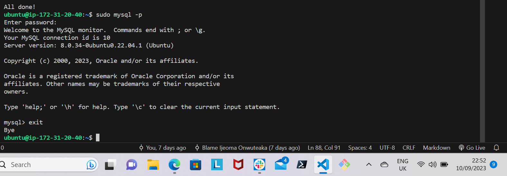
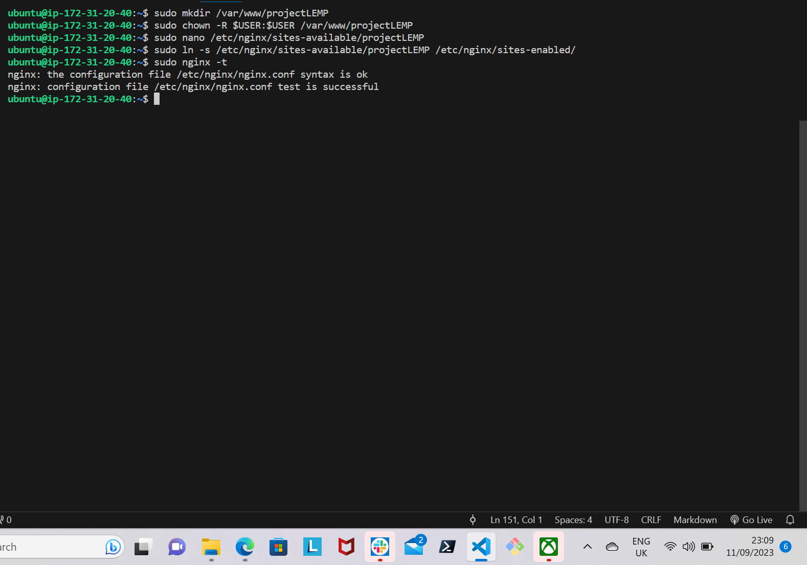

# LEMP STACK IMPLEMENTATION (Linux, Nginx, MySQL and PHP)

## Prerequisites
- Open an account with AWS.
- Create an EC2 instance with Ubuntu server.
- Connect your instance to your virtual host via SSH.

STEP 1 - INSTALLING NGINX WEB SERVER

Install Nginx web server using ***apt*** package manager.

Update your server's package index with this command:

```python
'sudo apt update'
```


Install Nginx web server

```python
'sudo apt install nginx -y'
```


To verify that nginx is successfully installed and is running as a service in Ubuntu, run this command:

```python
'sudo systemctl status nginx'
```


To receive traffic by your web server, you need to open **TCP port 80** which is default port that web browsers use to access web pages in the internet.

Go to your EC2 instance and add a rule to EC2 configuration to open inbound connection through port 80:


To check how you can access the server loccaly in your Ubuntu shell, run this command:

```python
'curl http://localhost:80'
```


Then to test how the Ngnix server respond to request from the internet, do this:

Go to your EC2 instance, copy your public IP address and paste it in your browser.

http://Public-IP-Address


STEP 2 - INSTALLING MYSQL

To install this software, run this command:

```python
'sudo apt install mysql-server -y'
```


Afetr the installation, log in to the MySQL console by typing:

```python
'sudo mysql'
```


Set a password for the root user using mysql_native_password as default authentication method, type this:

```python
'ALTER USER 'root'@'localhost' IDENTIFIED WITH mysql_native_password BY 'your password';'
```

Exit the MySQL shell by typing 'exit'

Start the inetractive script by running this command:

```python
'sudo mysql_secure_installation'
```

It will ask you to validate password component, which you can decide to do so or leave it disabled.


Log in to MySQL concole with this command:

```python
'sudo mysql -p'
```

Exit the MySQL console by typing 'exit'




STEP 3 - INSTALLING PHP

Nginx requires an external program to handle PHP processing and act as a bridge between the PHP interpreter itself and the web server. You'll need to install ***php-fpm*** amd ***php-mysql***.

To install these 2 packages at once, run this command:

```python
'sudo apt install php-fpm php-mysql'
```


STEP 4 - CONFIGURING NGINX TO USE PHP PROCESSOR

Create a directory structure within ***/var/www*** for your domain_website.

Create a directory 'projectLEMP' using *mkdir*.

```python
'sudo mkdir /var/www/projectLEMP'
```
Next, assign ownership of the directory by running this command:

```python
'sudo chown -R $USER:$USER /var/www/projectLEMP'
```

Then create and open a new configurtion file in Nginx sites-available using this command:

```python
'sudo nano /etc/nginx/sites-available/projectLEMP'
```

A new blank file will be created, paste in the below bare-bones configuration


Save and close the file by typing 'ctrl+X' and the 'y' and hit 'ENTER' to confirm.

Activate your configuration by linking to the config file form Nginx site-enabled directory. Run this command:

```python
'sudo ln -s /etc/nginx/sites-available/projectLEMP /etc/nginx/sites-enabled/'
```

By doing this, it will tell Nginx to use the configuration next time it is reloaded.

To test your configuration for syntax errors, type this:

```python
'sudo nginx -t'
```


Next, is to disable default Nginx host that is configured to listen on port 80, use this command:

```python
'sudo unlink /etc/nginx/sites-enabled/default'
```

For the changes to take effect, reload Nginx.

```python
'sudo systemctl reload nginx'
```

Create an index.html file to test that your new server works as expected, run this command:

```python
'sudo echo 'Hello LEMP from hostname' $(curl -s http://169.254.169.254/latest/meta-data/public-hostname) 'with public IP' $(curl -s http://169.254.169.254/latest/meta-data/public-ipv4) > /var/www/projectLEMP/index.html'
```

Open your website URL using your EC2 instance public IP address on your browser.

```python
'http://<Public-IP-Address>'
```


STEP 5 - TESTING PHP WITH NGINX

To test that Nginx can correctly hand ***.php*** files off to your PHP processor, create a PHP file in your document root.

Create a new file ***info.php*** inside your document root by typing:

```python
'nano /var/www/projectLEMP/info.php'
```

Then paste the below Valid PHP code in the file, save and close it.

```python
'<?php
phpinfo();'
```

Now to access this page, go to your browser and open your IP address followed by ***/info.php***.

```python
'http://'IP-address'/info.php'
```
Your browser will load a similar page like this:


The file you created contains sensitive information about your PHP environment and Ubuntu server, as a result, it is best to remove the file. To do so, type this:

```python
'sudo rm /var/www/projectLEMP/info.php'
```

STEP 6 - RETRIEVING DATA FROM MYSQL DATABASE WITH PHP

Create a test database and configure access to it, this is to ensure that Nginx can query data from database and display it. 

So as to connect to the MySQl database from PHP, you'll need to create a new user with the ***'mysql_native_password'*** authentication method. 

Connect to the MySQL console using the root account.

```python
'sudo mysql'
```

Create a new database using the following command:

```python
'CREATE DATABASE `example_database`;'
```

Create a new user, using mysql_native_password as default authentication method.

```python
'CREATE USER 'example_user'@'%' IDENTIFIED WITH mysql_native_password BY 'PassWord.1';'
```

Now, grant him full priviledges on the databse you created.

```python
'GRANT ALL ON example_database.* TO 'example_user'@'%';'
```

Exit the MySQL shell by typing '*exit*'

To test if the new user has appropriate permission, log in to MySQL console again using the user credential you created. Use this command and type in the password you created when prompted.

```python
'mysql -u example_user -p'
```


Confirm that you have access to the database you created, type this:

```python
'SHOW DATABASES;'
```

Next is to create a test table named **todo_list**. To do this, run the following statement:

```python
'CREATE TABLE example_database.todo_list (item_id INT AUTO_INCREMENT,content VARCHAR(255),PRIMARY KEY(item_id));'
```

Insert rows of content into the table with this command and repeat it depending on how many rows you want to insert.

```python
'INSERT INTO example_database.todo_list (content) VALUES ("My first important item");'
```

To confirm that the data was successfully saved to your table, run:

```python
'SELECT * FROM example_database.todo_list;'
```


Type '*exit*' to exit from the MySQL console

To connect to MySQL and query for your content, you'll create a new PHP file in your web root root directory by using any text editor of your choice.

```python
'nano /var/www/projectLEMP/todo_list.php'
```
In the blank file, paste the following into your ***todo_list.php***

```python
'<?php
$user = "example_user";
$password = "PassWord.1";
$database = "example_database";
$table = "todo_list";

try {
  $db = new PDO("mysql:host=localhost;dbname=$database", $user, $password);
  echo "<h2>TODO</h2><ol>";
  foreach($db->query("SELECT content FROM $table") as $row) {
    echo "<li>" . $row['content'] . "</li>";
  }
  echo "</ol>";
} catch (PDOException $e) {
    print "Error!: " . $e->getMessage() . "<br/>";
    die();
}'
```
Save and close the file.

Now to access this page, paste your IP-address followed by ***/todo_list.php*** in your browser.

```python
'http://<Public-IP-address>/todo_list.php'
```

A page like shown below should display: 


